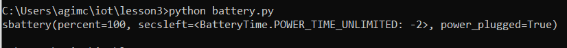
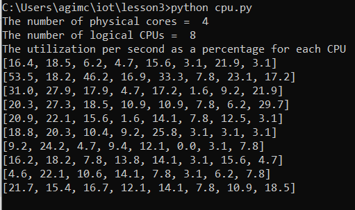
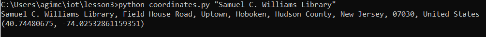
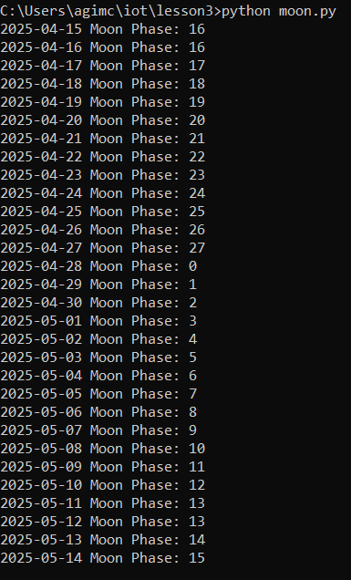
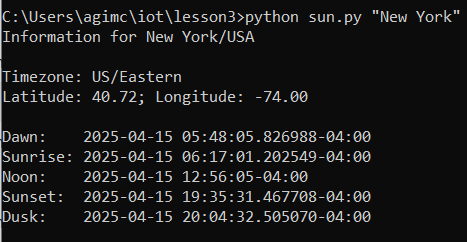
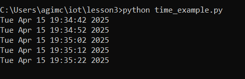
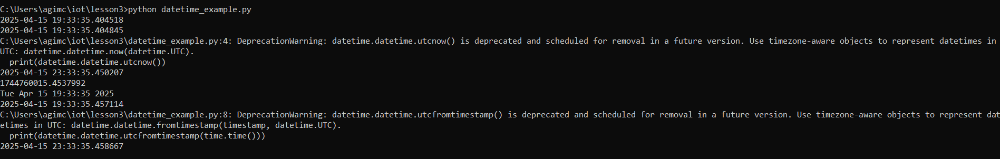
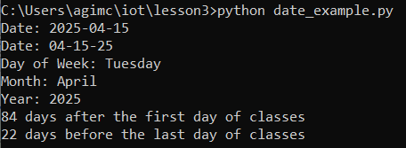
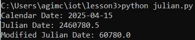
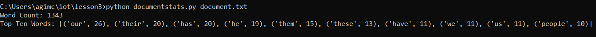

# Lab 3 – Python Scripts for Date, Time, Location, and System Info

This lab demonstrates the use of Python libraries for handling date/time, astronomical data (sun and moon), geolocation, system resource monitoring, and text analysis.

---

## ✅ Scripts & Sample Output

### 🔋 `battery.py`
Displays battery status and power connection.


---

### 🧠 `cpu.py`
Shows CPU core count and real-time utilization.


---

### 📍 `address.py`
Performs reverse geocoding (coordinates → location).
.png)

---

### 📌 `coordinates.py`
Geocoding (place name → coordinates).


---

### 🌙 `moon.py`
Displays upcoming moon phases.


---

### ☀️ `sun.py`
Shows sunrise, sunset, dawn, and dusk times.


---

### ⏰ `time_example.py`
Prints local time repeatedly every second.


---

### 🗓️ `datetime_example.py`
Prints current UTC time and timestamp data.


---

### 📆 `date_example.py`
Shows formatted date breakdown and semester day count.


---

### 📅 `julian.py`
Converts today's date to Julian and Modified Julian Date.


---

### 📄 `documentstats.py`
Performs a word count and lists top 10 words in a text file.


---

## 🔧 Required Python Packages

Install with:
```bash
pip install jdcal astral geopy pytz
