# Lab 4 – Django Web Framework (CPE 322)

This lab demonstrates setting up and running a basic Django application using Python. The goal was to install Django, configure project settings, create a minimal web app, and verify functionality through a browser.

---

## Installation & Setup Steps

### 1. Installed Required Packages
```bash
pip3 install -U django djangorestframework django-filter markdown requests
```
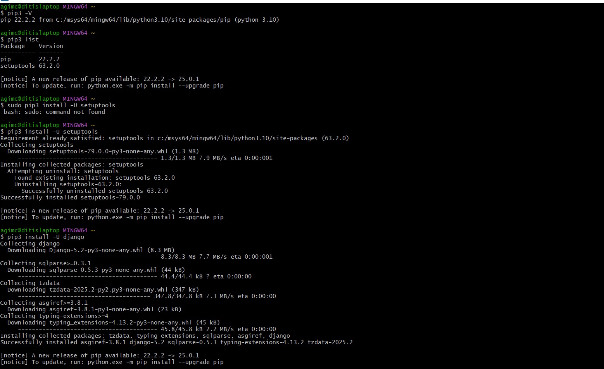  
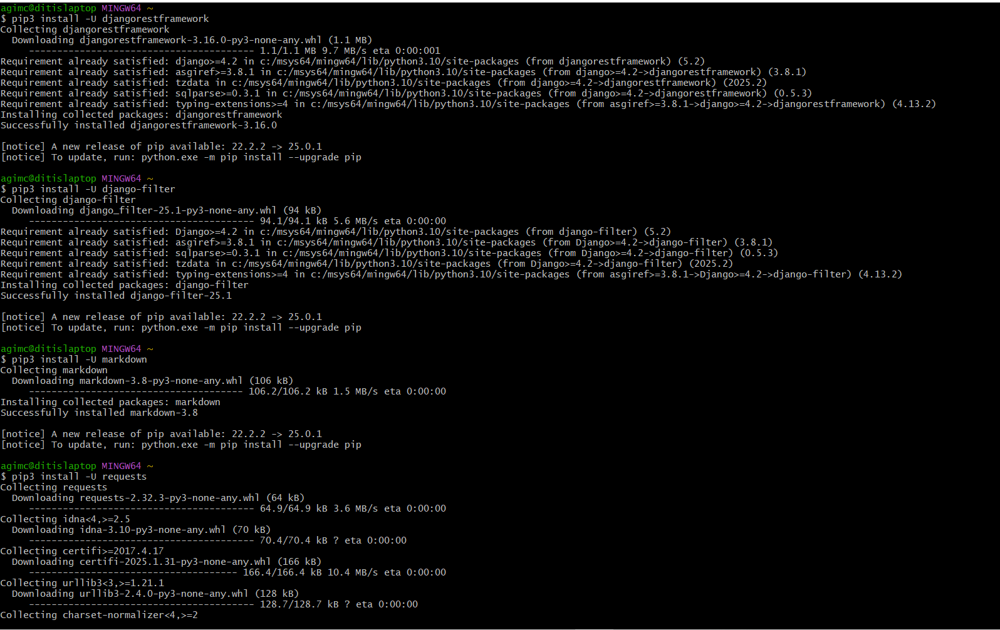  
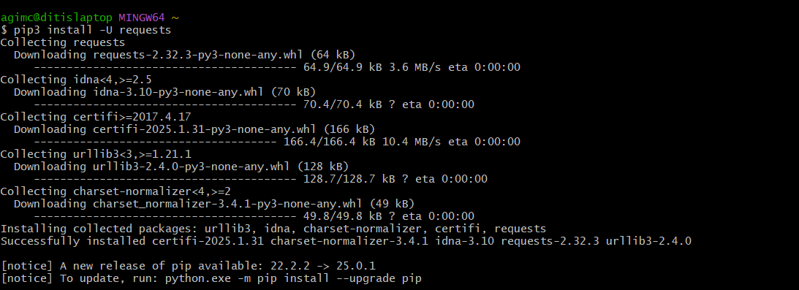  

---

### 2. Created Project and App
```bash
django-admin startproject stevens
cd stevens
python manage.py startapp myapp
```
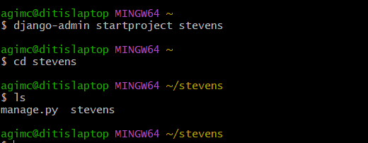  
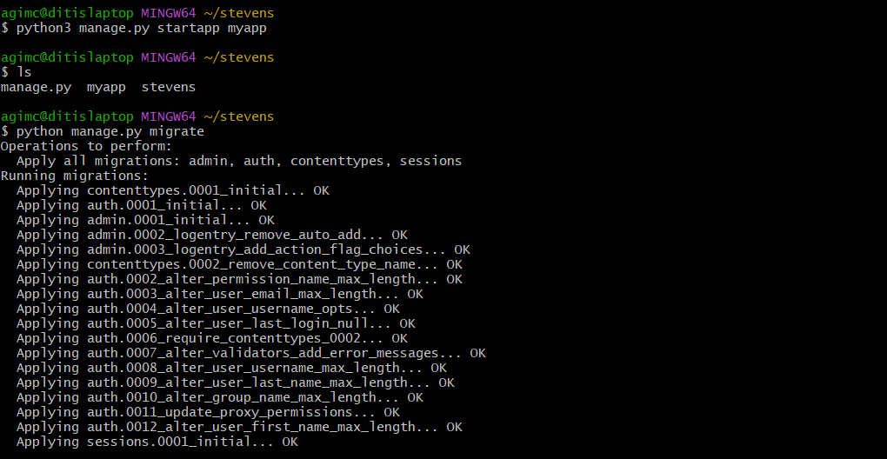  

---

### 3. Updated settings.py
- Added `'myapp'` to `INSTALLED_APPS`
- Set `ALLOWED_HOSTS = ['*']`
- Set `TIME_ZONE = 'America/New_York'`

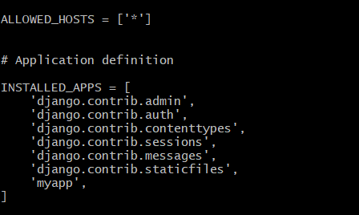  
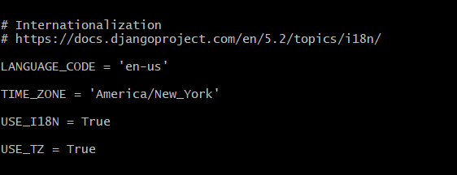  

---

### 4. Created View in myapp/views.py
```python
from django.http import HttpResponse

def index(request):
    return HttpResponse("Hello from my IoT Django app!")
```
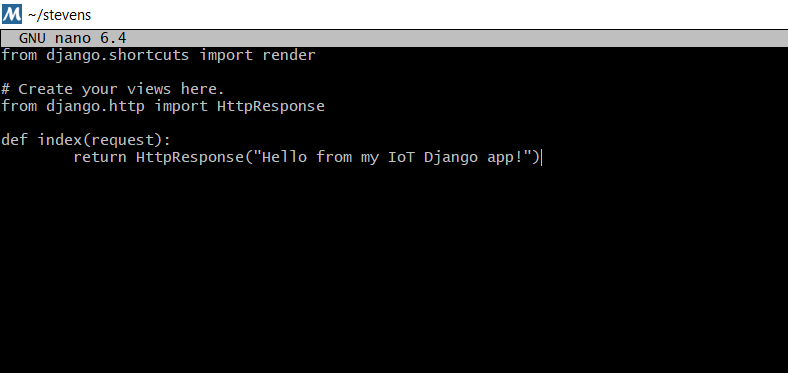

---

### 5. Created URL Mappings

**myapp/urls.py**
```python
from django.urls import path
from . import views

urlpatterns = [
    path('', views.index),
]
```
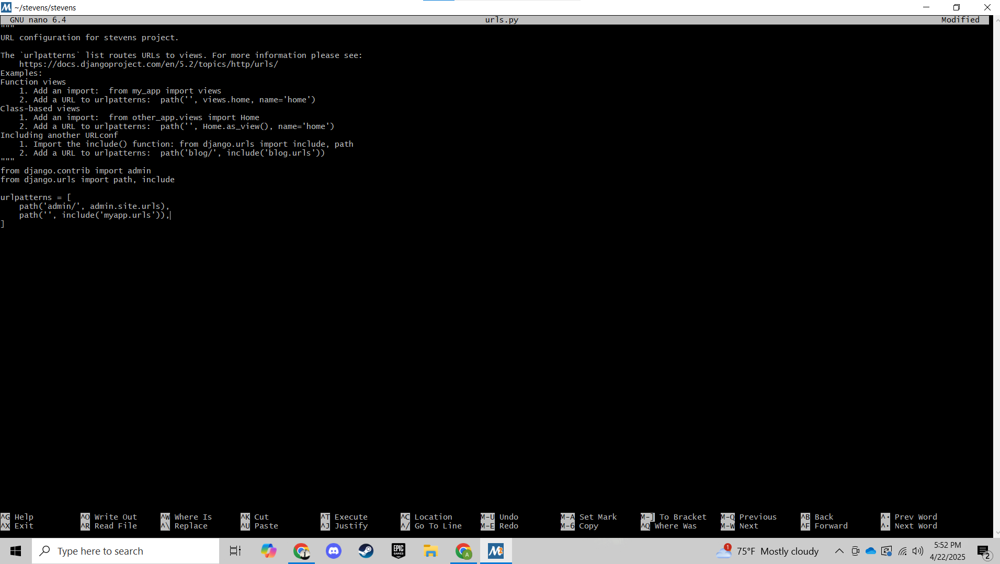

**stevens/urls.py**
```python
from django.contrib import admin
from django.urls import path, include

urlpatterns = [
    path('admin/', admin.site.urls),
    path('', include('myapp.urls')),
]
```
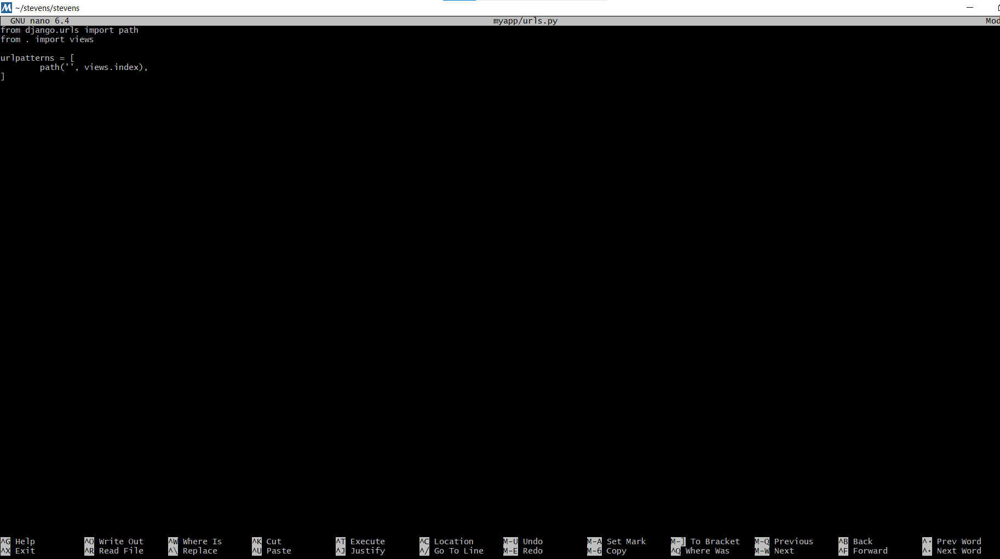

---

### 6. Ran Server and Verified Output
```bash
python manage.py runserver
```
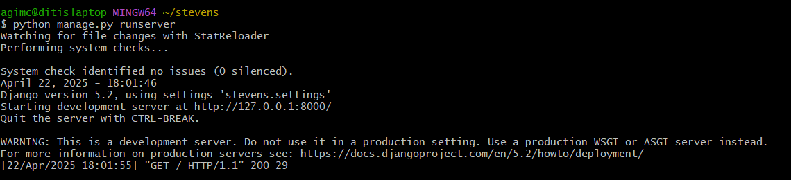  
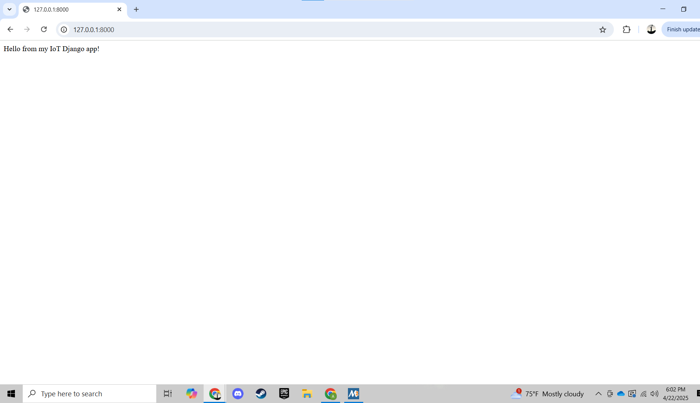

---

## Conclusion

All required packages were installed successfully. The Django application was created, configured, and verified through browser output. The basic view and URL routing are functional, completing the required portion of Lab 4.
